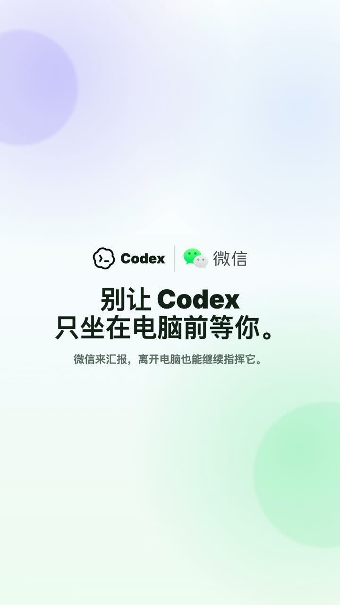

# Codex WeChat Handoff

Stop re-explaining your Codex context from your phone.

A Codex Desktop/CLI thread on your computer already has project background, constraints, files, and next steps? Carry that context to WeChat, keep going from your phone, then pull the phone-side transcript back when you return.

**Local daemon · personal WeChat iLink QR · no public callback · project allowlist · read/write/fullaccess modes**

It also supports regular WeChat-side mobile sessions. The default `inbox` is a safe WeChat-only workspace for lightweight tasks and file generation. Configured projects can be linked to real local code directories, so Codex can inspect code, investigate issues, summarize diffs, generate reports, or write project files when the selected mode allows it.

[中文 README](README.md)

## 30-Second Overview

### 1. Carry Desktop / CLI context to WeChat

You already have a Codex thread on your computer with project context and decisions. Before leaving your desk, tell Codex:

```text
carry this to WeChat
```

After WeChat receives `continue from here`, reply normally to continue from that existing context instead of starting a blank mobile chat.

When you are back at your computer, tell Codex:

```text
pull WeChat back
```

The WeChat-side conversation and conclusions are brought back as transcript context so you can continue the original workflow.

```text
Codex Desktop / CLI
  -> carry this to WeChat
  -> continue the context in WeChat
  -> pull WeChat back
  -> transcript returns to Desktop
```

### 2. Get a WeChat notification when a run finishes

You do not have to switch to the phone immediately. You can ask the bridge to notify WeChat when a Desktop / CLI run finishes:

```bash
codex-wechat notify-finish on --to last
```

When a run finishes, WeChat gets a concise notification. You can:

- reply `/continue` to continue that Desktop workflow from your phone
- ignore it and keep the previous WeChat project / session untouched
- return to the computer and run `pull WeChat back` first if there is phone-side context

### 3. Start mobile sessions directly from WeChat

After installation, you get a default `inbox` workspace. It is a WeChat-only safe workspace for:

- organizing ideas
- generating Markdown / HTML / PDF
- lightweight research and summaries
- sending images, files, and reports back to WeChat

You can also add real code projects:

```bash
codex-wechat project add vibelight --cwd /absolute/path/to/vibelight --mode read
```

Then switch from WeChat:

```text
/projects
/project vibelight
/status
```

Each project has its own mobile session, so different project contexts stay separate.

## Not Another WeChat Bot

This is not just Codex inside a WeChat chat window.

Codex WeChat Handoff is about carrying computer-side Codex context into WeChat, continuing there, and pulling the phone-side transcript back to Desktop/CLI later.

## This Is Not a Mobile Remote Desktop

Many phone-control tools focus on watching runtime state, approving actions, or operating a remote terminal.

Codex WeChat Handoff focuses on a different problem:

> I already built up useful context in a Codex thread on my computer. Can I continue from that context in WeChat?

The core is not opening a new bot chat. The core is handing context between Desktop/CLI, WeChat continuation, and normal mobile sessions.

## Who It Is For

- Codex Desktop / CLI power users who do not want to lose thread context
- people who leave their computer often but still want to move lightweight coding-agent work forward from WeChat
- solo builders who want a local Codex mobile surface inside WeChat
- agent workflow hackers who prefer local-first, auditable tools with explicit permission boundaries

## Who It Is Not For

- team customer-support bots
- a full mobile IDE or remote desktop
- Windows-first workflows that need a fully verified out-of-the-box path today
- users who do not want to use personal WeChat iLink QR setup

## Demo

[](docs/readme-media/codex-wechat-handoff-demo.mp4)

Click the image to watch the demo video.

It shows two common moments when you leave your computer:

- Codex finishes a task on your computer and notifies you in WeChat.
- When you need to step out, move the current task into WeChat and keep pushing it forward from your phone.

## One-Line Install

Run this to install the CLI and Codex skill, create the default `inbox`, scan QR for WeChat iLink setup, run checks, and start the background daemon:

```bash
curl -fsSL https://raw.githubusercontent.com/FUY25/codex-wechat-handoff/main/install.sh | bash
```

The installer will:

- install `codex-wechat` CLI to `~/.local/bin/codex-wechat`
- install the Codex skill to `~/.codex/skills/codex-wechat`
- create the default WeChat-only `inbox`
- complete personal WeChat iLink setup through QR
- run `codex-wechat doctor`
- install the background daemon
- print daemon status

After QR setup, open WeChat and send:

```text
/onboarding
```

## Codex Desktop Understands It Too

The installer also installs the `codex-wechat` skill. After that, you can ask Codex Desktop / CLI to operate the bridge in natural language:

```text
carry this to WeChat
```

```text
pull WeChat back
```

```text
Add /Users/me/code/my-app to the WeChat project allowlist in read mode, then run doctor.
```

```text
Render this HTML report to PDF and send it to WeChat.
```

The skill helps Codex choose the right `codex-wechat` command, such as `carry-current`, `pull`, `project add`, `doctor`, `render-html`, or `send-file`. During installation and setup, do not paste tokens into chat, and do not publish `account.json` or sender ids.

If you want WeChat to notify you when the current Desktop/CLI run finishes, you can tell Codex:

```text
Notify me on WeChat when this run finishes, then let me decide whether to continue from my phone.
```

Codex will use `notify-finish` when appropriate. It will not automatically steal the current WeChat session.

## Manual Installation

Use this only if you want to run each step yourself:

```bash
curl -fsSL https://raw.githubusercontent.com/FUY25/codex-wechat-handoff/main/install.sh | bash -s -- --install-only
codex-wechat init
codex-wechat project add my-project --cwd /absolute/path/to/my-project --mode read
codex-wechat setup
codex-wechat daemon install
codex-wechat doctor
```

`codex-wechat init` creates the default WeChat-only `inbox` project:

```text
~/.codex-wechat-handoff/workspaces/inbox
```

Add real code folders explicitly:

```bash
codex-wechat project add vibelight --cwd /absolute/path/to/vibelight --mode read
```

The setup flow stores credentials under:

```text
~/.codex-wechat-handoff
```

Do not paste, publish, screenshot, or commit those credential files.

## Install With One Prompt

In Codex Desktop or another local coding agent, say:

```text
Install Codex WeChat Handoff by following:
https://raw.githubusercontent.com/FUY25/codex-wechat-handoff/main/INSTALL.md

Start by setting up carry-over from Codex Desktop to WeChat.
Then install the daemon, skill, and run doctor.
Do not ask me to paste tokens.
```

After installation, you can ask Codex to add project allowlist entries:

```text
Add this repo to codex-wechat projects in read mode, then tell me which WeChat commands to send.
```

## Project And Session

### `inbox`

The default WeChat-only workspace:

```text
~/.codex-wechat-handoff/workspaces/inbox
```

It is a bridge-owned safe starting point for mobile-side lightweight tasks, temporary files, and report generation. It can be writable by default.

### `project`

A local workspace you allow WeChat to route into, such as `vibelight`, `marklab`, or `handoff`.

Add a project:

```bash
codex-wechat project add vibelight --cwd /absolute/path/to/vibelight --mode read
codex-wechat doctor
```

Then from WeChat:

```text
/projects
/project vibelight
/status
```

### `mobile session`

A WeChat sender + project maps to its own mobile-side Codex thread. Each project can have its own mobile session.

`/project <name>` does not mutate the cwd of an old thread. It switches to that project’s own mobile session/thread. The mode is restored from that project’s session or default config.

### `carry-over`

Forks the current Desktop/CLI thread into a phone-side continuation so WeChat can continue that existing context. WeChat does not write directly into the live Desktop thread.

### `pull-back`

Brings the WeChat-side raw transcript back to the computer so Desktop/CLI can continue the original workflow.

### `detach`

Exits the current Desktop carry-over and returns WeChat to its previous project mobile session.

## Carry A Desktop / CLI Thread To WeChat

From an active Codex Desktop or CLI thread:

```bash
codex-wechat carry-current --project current --to last
```

Or tell Codex:

```text
carry this to WeChat
```

The bridge sends a WeChat message that starts with:

```text
continue from here
```

After that, ordinary WeChat replies continue the forked mobile continuation. Active project, mode, Desktop thread, and mobile thread are tracked per WeChat sender.

Carry-over is a handoff lease, not two live entry points controlling the same thread at the same time. Once the carry notification arrives, continue from WeChat. If you type into the same Desktop/CLI thread before pulling back, the bridge treats that as a return to Desktop and pauses WeChat remote mode. WeChat will resume only after `/resume`, `/detach`, or a fresh carry.

When you return to the computer, tell Codex:

```text
pull WeChat back
```

CLI fallback:

```bash
codex-wechat pull --project current
```

The CLI prints a `WeChat raw handoff` and tells WeChat that the session moved back to Desktop.

## Finish-Run Notifications

If you are working on the computer but want a WeChat ping when a Codex run finishes, enable finish-run notifications:

```bash
codex-wechat notify-finish on --to last
```

Check status:

```bash
codex-wechat notify-finish status --to last
```

Inherit the default:

```bash
codex-wechat notify-finish inherit --to last
```

Set a sender-level default:

```bash
codex-wechat notify-finish default off --to last
```

The notification is only an invitation. It does not steal the current WeChat session. After receiving it:

- reply `/continue` to continue that Desktop workflow from your phone
- ignore it and keep the previous WeChat project / session untouched
- return to the computer and run `pull WeChat back` first if there is phone-side context

Finish-run toggles are controlled from Desktop/CLI. WeChat-side `/notify status` is read-only.

## WeChat Commands

```text
/intro                 short carry-over intro
/onboarding            full carry-over, project, and command guide
/projects              list configured projects
/project <name>        switch to that project's own mobile session/thread
/mode read             read/search readable local files, network enabled, no writes
/mode write            read/search/network, write only inside current project cwd
/mode fullaccess       unrestricted local access
/model                 show current model
/model <name>          set model override for this sender + project
/model default         clear model override
/status                show current session type, project, mode, model, thread, lease, cwd
/health                show daemon and recent bridge health
/current               show current route and parked thread
/sessions              show sender project sessions
/attach latest         attach latest project session to WeChat
/attach <thread_id>    attach a specific Codex thread
/back                  request pull-back to Desktop
/resume                resume phone remote mode
/continue              continue from a finish-run notification on the phone
/detach                exit Desktop carry-over and return to prior WeChat session
/notify status         show finish-run notification status, read-only
/history [n]           show recent history entry point
/new                   start a new phone-side Codex thread for current project
/stop                  show current stop/interrupt status
/help                  list commands
```

The default `inbox` project starts in `write` mode because it lives inside the bridge-owned workspace. Real code projects should usually start in `read` mode.

Permission modes:

- `read`: can read/search readable local files and use network access, but cannot write files.
- `write`: can read/search readable local files and use network access, but can write only inside the active project cwd.
- `fullaccess`: unrestricted local access. Use this only when you intentionally want full local control from WeChat.

`/mode bypass` is kept as a legacy alias for `/mode fullaccess`.

If a Desktop thread is near or at the model context window, the bridge reads local Codex rollout token usage before carrying/forking. The status appears in `/status`, `carry-status`, and carry notifications, for example `context: high (90%, 90k/100k)`. If the state is `critical` or `saturated`, the bridge blocks native fork and tells you to run `/compact` in the current Desktop/CLI thread before retrying.

The bridge does not silently fall back to summary handoff, so you do not mistake a summarized phone session for a full native thread. Phone-side work and pull-back still use raw transcript deltas for context transfer.

`/status` explicitly tells you whether the phone is in a normal mobile session or a Desktop carry-over:

```text
session: mobile native
```

or:

```text
session: carry-over from Desktop (phone active)
session: carry-over from Desktop (paused; Desktop active)
session: carry-over from Desktop (waiting Desktop pull)
```

## Why Not Just A WeChat Bot?

A regular bot often means:

- open a new chat in WeChat
- send messages to an agent
- switch model or directory with commands

Codex WeChat Handoff adds thread handoff:

- start from existing Codex context on your computer
- keep the WeChat-side continuation
- pull the raw transcript back to Desktop/CLI later
- manage project, session, and mode separately
- send rich artifacts back through WeChat

## Rich Artifacts: Images, PDFs, Reports

Codex can send files and images back through WeChat. Replies can include these markers:

```text
WECHAT_IMAGE: /absolute/path/to/image.png
WECHAT_FILE: /absolute/path/to/report.pdf
WECHAT_VOICE: /absolute/path/to/audio.silk playtime_ms=2000
```

Useful for:

- code diff review
- frontend design decisions
- UI option comparison
- architecture diagrams
- data/research reports
- multi-page Markdown/PDF output

For visual design choices, code diffs, diagrams, or reports, generate HTML first, then render:

```bash
codex-wechat render-html \
  --html /absolute/path/to/report.html \
  --pdf /absolute/path/to/report.pdf \
  --png /absolute/path/to/report.png \
  --renderer auto
```

`--renderer auto` uses Chrome, Chromium, or Edge when available. On macOS without a browser, it falls back to Quick Look PNG output and `sips` image-based PDF output.

Send files directly:

```bash
codex-wechat send-text --to last --message "Progress update."
codex-wechat send-file --file /absolute/path/to/report.pdf --to last --message "Report attached."
codex-wechat send-image --file /absolute/path/to/preview.png --to last --message "Preview attached."
```

## Security Model

Codex WeChat Handoff is a local bridge, not a public webhook.

- personal WeChat iLink QR authorization
- local daemon long-polls messages
- no public callback URL
- no public WebSocket server required
- credentials live in the local state dir
- sender allowlist controls who can trigger Codex
- project allowlist controls available projects and write roots
- `/mode read` cannot write files
- `/mode write` only writes inside the current project cwd
- `/mode fullaccess` is unrestricted local access

Note: `read` and `write` modes are not hard read sandboxes. They can still read/search local files that are readable by the process. The enforced boundary is write access: `read` does not write files, and `write` only writes inside the current project cwd.

Recommended defaults:

- `inbox` can use `write`
- real code projects should start in `read`
- switch to `write` only when you want project edits
- use `fullaccess` carefully

Sensitive files include:

```text
~/.codex-wechat-handoff/account.json
~/.codex-wechat-handoff/projects.json
~/.codex-wechat-handoff/logs/
```

Do not paste, publish, commit, or screenshot those files.

See [docs/security-model.md](docs/security-model.md).

## Platform Status

macOS is the most tested and stable path today. The background daemon uses macOS LaunchAgent:

```bash
codex-wechat daemon install
codex-wechat daemon status
```

The CLI is designed to avoid a single-platform assumption, but Windows has not been fully verified. On non-macOS environments, start with foreground listener / manual flow before wiring your own system service.

## Known Limitations

- macOS LaunchAgent is the only fully validated daemon path today.
- WeChat iLink setup is currently tested against the iOS WeChat QR flow.
- This is a personal local bridge, not a team bot/control plane.
- `read` / `write` modes are not read sandboxes: they constrain writes, not all reads.
- `write` mode can still read/search locally readable files and use the network, but it writes only inside the active project cwd.
- If a Desktop thread is near the context limit, native carry-over asks you to run `/compact` in Desktop/CLI first. It does not silently summary-fallback.
- iLink is an external protocol surface; if WeChat behavior changes, the bridge may need an update.

## How It Works

```text
WeChat
  -> iLink long polling
  -> local codex-wechat daemon
  -> forked mobile continuation / project session
  -> iLink sendmessage
  -> WeChat reply
```

There is no public callback URL. The local daemon polls iLink, routes allowed messages to Codex, and sends replies back through WeChat.

Carry-over does not make WeChat write directly into the live Desktop thread. The bridge forks the current Desktop thread into a mobile continuation; WeChat writes that mobile continuation; pull-back returns the `WeChat raw handoff` to the current Desktop chat.

## Project Config

Create the default config:

```bash
codex-wechat init
```

Result:

```text
defaultProject: inbox
cwd: ~/.codex-wechat-handoff/workspaces/inbox
mode: write
```

Add a real code project:

```bash
codex-wechat project add vibelight --cwd /absolute/path/to/vibelight --mode read
codex-wechat doctor
```

Or start from the example:

```bash
cp projects.example.json ~/.codex-wechat-handoff/projects.json
```

Example:

```json
{
  "defaultProject": "example",
  "allowedSenderIds": ["replace-with-your-wechat-sender-id-after-binding"],
  "projects": {
    "example": {
      "cwd": "/absolute/path/to/your/project",
      "defaultMode": "read"
    }
  }
}
```

For public or shared installs, keep sender access explicit. If `allowedSenderIds` is non-empty, only those WeChat senders can trigger Codex.

## Daemon

Install the macOS LaunchAgent:

```bash
codex-wechat daemon install
```

Inspect it:

```bash
codex-wechat daemon status
codex-wechat daemon logs
```

Stop or remove it:

```bash
codex-wechat daemon stop
codex-wechat daemon uninstall
```

Remove the local install and state completely:

```bash
codex-wechat daemon uninstall
rm -f ~/.local/bin/codex-wechat
rm -rf ~/.codex/skills/codex-wechat
rm -rf ~/.codex-wechat-handoff
```

The last line deletes WeChat credentials, session state, logs, and the default `inbox` workspace.

The legacy scripts remain thin wrappers:

```bash
scripts/install-launch-agent.sh
scripts/uninstall-launch-agent.sh
```

## CLI Reference

```text
codex-wechat init [--project NAME] [--cwd PATH] [--mode read|write|fullaccess]
codex-wechat project add <name> --cwd PATH [--mode read|write|fullaccess]
codex-wechat project list
codex-wechat setup [--force]
codex-wechat doctor
codex-wechat daemon install|status|logs|stop|uninstall
codex-wechat carry-current [--project current|NAME] [--to last|SENDER] [--thread-id ID]
codex-wechat pull-current [--project current|NAME] [--thread-id ID]
codex-wechat carry-status [--project current|NAME]
codex-wechat discover-sessions [--project current|NAME]
codex-wechat notify-finish on|off|inherit|status|default on|default off|send [--project current|NAME] [--to last|SENDER] [--summary "..."] [--next-action "..."]
codex-wechat start [--workspace PATH] [--projects PATH]
codex-wechat render-html --html PATH [--pdf PATH] [--png PATH] [--renderer auto|chrome|quicklook]
codex-wechat send-text --message "..." [--to last|SENDER]
codex-wechat send-file --file PATH [--to last|SENDER] [--message "..."]
codex-wechat send-image --file PATH [--to last|SENDER] [--message "..."]
```

Short aliases:

```text
codex-wechat carry
codex-wechat pull
codex-wechat status
codex-wechat sessions
```

Common options:

```text
--state-dir PATH             default: ~/.codex-wechat-handoff
--projects PATH              project route config JSON
--backend app-server|exec    default: app-server
--codex-bin PATH             default: codex
--model MODEL                optional startup-level Codex model default
--codex-timeout-ms N         default: 600000
--dry-run                    generate replies without sending to WeChat
```

## Troubleshooting

Start with:

```bash
codex-wechat doctor
codex-wechat daemon status
codex-wechat daemon logs
```

If the QR link opens with a network error, scan the generated QR image with iOS WeChat instead of opening the link.

If WeChat messages arrive but no reply is sent, check:

```bash
codex-wechat doctor
codex-wechat daemon status
codex-wechat daemon logs
```

See [docs/troubleshooting.md](docs/troubleshooting.md).

## Development

```bash
bun install
bun test codex-wechat-ilink.test.ts
git diff --check
```

The main implementation currently lives in `codex-wechat-ilink.ts` so the install path stays simple. It can be split into modules after the public workflow is stable.
